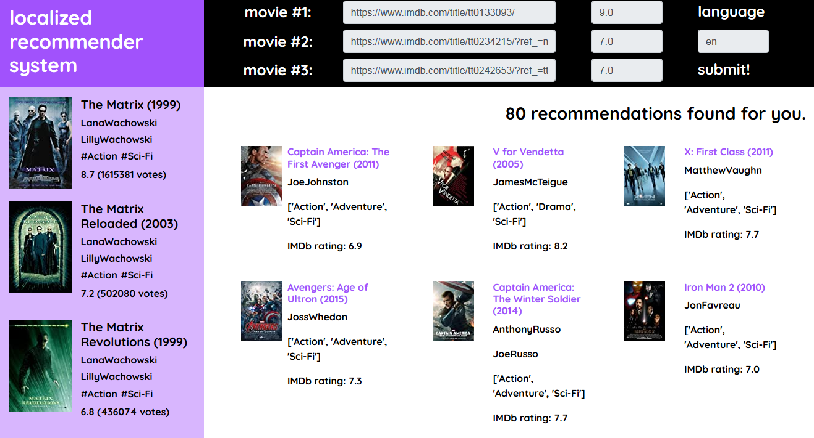

# Localized Recommender System
A real-time recommendation system for movies, based on data scraped from IMDb. 
There is mo prepared dataset; the app takes input in the form of IMDb urls.
Currently the number of inputs is being limited to 3; however, I plan on expanding that.
This is truly end-to-end in nature; the dataset, user profile & the model, all of them are prepared in real-time & no data is stored in advance. 
Datasets with movie details have the drawback of having a limited & time period pool of movies to recommend from; this app does not suffer from that.

### How to run:
- Clone this repository, & install all the reuired libraries mentioned in requirements.txt.
- Using terminal emulators, enter into the concerned directory, & run command: <code>python3 app.py</code>. For windows users, use cmd & run command: <code>python app.py</code>.

### Inputs
- IMDb urls of 3 movies of your choice, & your ratings (out of 10) of them

### Output
- Please understand there is no predefined dataset or model in pickled form. Therefore, the app takes a little time to produce output.
- Time taken to produce recommendations depends upon the number of the unique genres present in the movies supplied as inputs
- Sometimes the app may take upto 5 minutes to produce recommendations. This is due to extensive web scraping from IMDb.

### Why didn't you deploy this in Heroku?
- Heroku does not allow one to use web-crawlers in their app; I did try to deploy this in Heroku but failed miserably.
- If you know, please inform me how to deploy this on any other platform.

### What can be improved?
- The UI is a bit of a mess, & right now I am showing upto 6 recommendations only. In next versions I plan to paginate the recommendation outputs so that they are scrollable & easier to view.
- Currently, this logic is only limited to movie recommendations; I plan on expanding that to include TV-shows in future.

